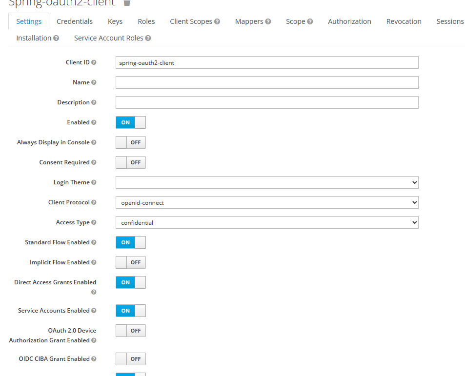
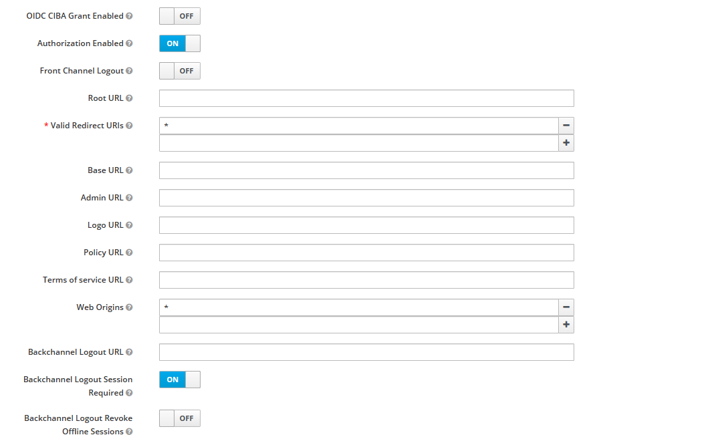
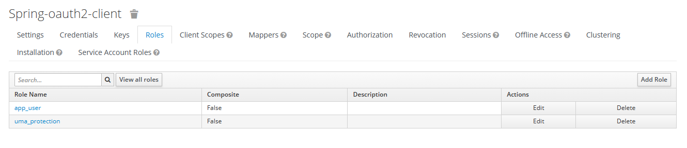
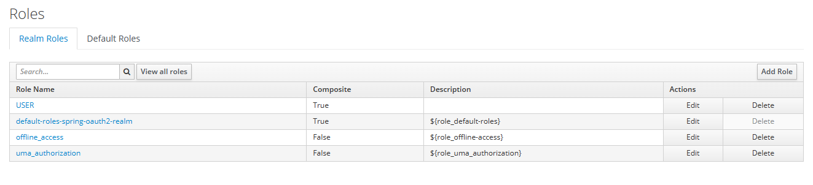
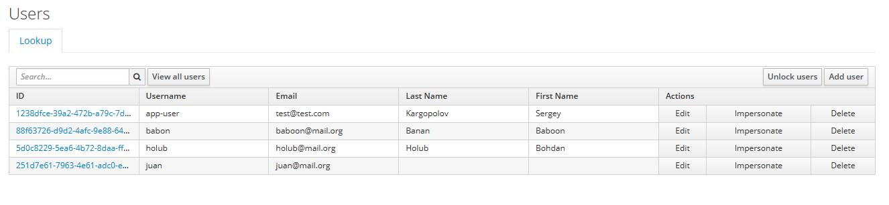

Resources that I used:

https://stackoverflow.com/questions/60359979/keycloak-admin-rest-api-unknown-error-for-update-user-api

https://stackoverflow.com/questions/71317507/how-can-i-create-user-with-multiple-client-roles-in-a-single-api/72187690#72187690

https://www.appsdeveloperblog.com/keycloak-rest-api-create-a-new-user/

...

...

...

...
